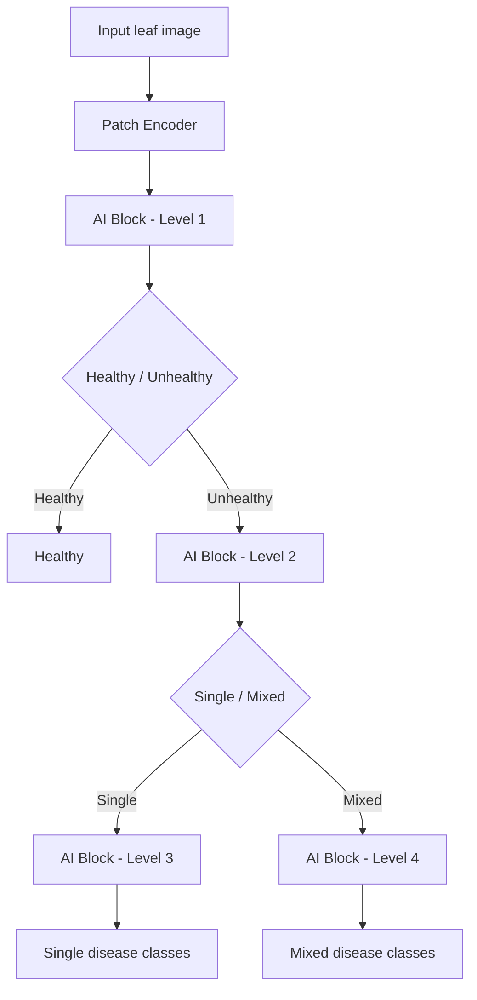

# Using GenAI (LLMs) to Upgrade MLTSDC for Mixed Sugarcane Leaf Diseases

M.Tech (Data Science) research project focused on **improving sugarcane leaf disease classification in real field settings** by addressing a key limitation of the baseline **MLTSDC (Multi-Level Transformer-Based Sugarcane Disease Classifier)**: the lack of **mixed/co-occurring infection samples** (e.g., *Mosaic + Rust on the same leaf*) and variability across **lighting/climate conditions**.

This repository currently contains:
- a **prompt bank** (`prompt.csv`) used to generate **synthetic mixed-disease images** with GenAI tools/models
- a **project slide deck** (`Using LLM to Upgrade Multi-Level Transformer-Based Sugarcane Disease.pptx`) documenting motivation, research gap, and progress

---

## Problem
Existing sugarcane leaf datasets and many models perform well for **single-label disease classification**, but mixed infections and symptom overlap are common in farms. The baseline MLTSDC paper reports strong single-disease results, but mixed-disease coverage is limited due to dataset constraints.

**Goal:** create realistic mixed-disease samples using Generative AI and use them to upgrade the training pipeline so the classifier generalizes better to real fields.

---

## Model Architecture (Proposed)
The proposed model follows a **hierarchical multi-level pipeline** inspired by MLTSDC, and explicitly branches for **single vs mixed** infections.

- **Patch Encoder:** converts an input leaf image into patch/tokens for the transformer blocks
- **Level 1 (AI Block):** Healthy vs Unhealthy
- **Level 2 (AI Block):** Single disease vs Mixed disease (only for predicted Unhealthy images)
- **Level 3 (AI Block):** Single-disease classes
- **Level 4 (AI Block):** Mixed-disease classes (co-occurring diseases)



---

## Approach (High-Level)
1. **Identify common co-occurring disease pairs** from field reports and literature.
2. **Design prompts** that encode:
   - disease pair (symptoms for both diseases)
   - severity stage (*Early / Mid / Severe*)
   - climate/field condition (*Natural light / Humid / Dry climate / Rainy conditions*)
   - strict image constraints to match training data (256x256, JPEG, no text/watermarks, realistic backgrounds)
3. **Generate synthetic images** using accessible GenAI models (open/free where possible; paid APIs can be limiting).
4. **Integrate synthetic + real images** into an upgraded multi-level training setup for mixed infections.

---

## Experiments & Results (from `Research work.pptx`)
These are the intermediate results captured in the project presentation used during the M.Tech work.

### 1) Optimizer sweep on baseline MLTSDC (10 epochs, LR=0.001)
Goal: check whether optimizer/lr changes improve results (they did not materially help).

| Optimizer | Epochs | LR | Training (%) | Test L1 (%) | Test L2 (%) |
|---|---:|---:|---:|---:|---:|
| Adam | 10 | 0.001 | 80.45 | 95 | 90 |
| Adagrad | 10 | 0.001 | 79.00 | 98 | 83 |
| SGD | 10 | 0.001 | 78.00 | 93 | 80 |
| Nadam | 10 | 0.001 | 80.02 | 95 | 94 |

### 2) Preliminary training results (MLTSDC vs Proposed Model)
Setup used in the PPTX:
- Optimizer: Adam
- Learning rate: 0.001
- Epochs: 5
- Heads: 2

**Table 1: MLTSDC**
| Level | Training accuracy | Testing accuracy |
|---:|---:|---:|
| 1 | 85.77% | 81.40% |
| 2 | 49.06% | 40.58% |
| Overall | - | 65.23% |

**Table 2: Proposed Model**
| Level | Training accuracy | Testing accuracy |
|---:|---:|---:|
| 1 | 85.30% | 82.01% |
| 2 | 92.34% | 91.15% |
| 3 | 38.06% | 37.68% |
| 4 | 36.01% | 27.47% |
| Overall | - | 85.30% |

---

## Dataset Notes
The baseline MLTSDC work (referenced below) uses a Kaggle-style dataset with **6,748** sugarcane leaf images across **5 classes** (Healthy, Mosaic, Red Rot, Rust, Yellow), with real-world variation (angles/lighting) and standard augmentations.

This repository does **not** include the original dataset or generated images; it contains the **prompt bank** and research documentation used to create the synthetic extension.

---

## Tech Stack (Research)
- Computer Vision + Deep Learning (Transformer-based classifier)
- Prompt engineering for synthetic data generation
- GenAI image generators (e.g., Stable Diffusion / FLUX.1 / Gemini-style image models)
- Python tooling for dataset handling and experiments

---

## Prompt Bank (`prompt.csv`)
`prompt.csv` is the core artifact in this repo: **48 prompt templates** covering **4 disease pairs x 3 severities x 4 climates**.

**Columns**
- `ID`: prompt id
- `Pair_Code`: short code for the disease pair
- `Disease_Pair`: human-readable pair name
- `Severity`: `Early` / `Mid` / `Severe`
- `Climate`: `Natural light` / `Humid` / `Dry climate` / `Rainy conditions`
- `Prompt`: full text prompt for the image generator
- `Folder`: suggested folder name for saving generated images (matches `Pair_Code`)

**Disease pair mapping**
- `A`: Mosaic + Red Rot
- `B`: Mosaic + Yellow
- `C`: Mosaic + Rust
- `D`: Red Rot + Rust

---

## How to Use This Repo
This repo is designed to be a **research artifact + prompt dataset**. The exact generation/training code depends on the model/provider you choose (Stable Diffusion / Flux / Gemini / etc.). A typical workflow:

1. Generate images from `prompt.csv` using your preferred model/API.
2. Save images following a consistent structure, for example:
   - `data/synthetic/A/Early/Natural light/*.jpg`
   - `data/synthetic/D/Severe/Rainy conditions/*.jpg`
3. Combine with your real dataset and train/evaluate the classifier (MLTSDC-style multi-level pipeline).

**Minimal example: iterate prompts**
```python
import csv

with open("prompt.csv", newline="", encoding="utf-8") as f:
    for row in csv.DictReader(f):
        prompt_id = row["ID"]
        folder = row["Folder"]
        prompt = row["Prompt"]
        # send `prompt` to your image generator; save output under a folder based on `folder`
        print(prompt_id, folder)
```

---

## Repo Contents
- `prompt.csv`: prompt templates for mixed-disease synthetic data generation
- `Research work.pptx`: project presentation (problem, proposed model, and intermediate experiment results)
- `Using LLM to Upgrade Multi-Level Transformer-Based Sugarcane Disease.pptx`: supporting slide deck (motivation, gap analysis, workflow, progress)
- `colab_genation.ipynb`: currently empty placeholder (intended for Colab-based generation workflow)
- `post_process.py`: currently empty placeholder (intended for resizing/format conversion/quality checks)

Note: the `.pptx` files are git-ignored by default in `.gitignore`. Remove those ignore rules if you want to commit the presentations to GitHub.

---

## Project Status
- **Stage:** prompt bank + initial generation experiments completed; training the upgraded classifier is ongoing.

## Resume/Recruiter Summary (Copy-Paste Friendly)
- Built a **prompt-engineered synthetic dataset plan** to address **mixed infection** gaps in sugarcane leaf disease classification (MLTSDC extension).
- Curated **48 structured prompts** covering **4 overlapping disease pairs**, **3 severity levels**, and **4 climate conditions** to improve real-field generalization.
- Evaluated baseline training sensitivity to optimizer/learning-rate choices; identified **data coverage** (not hyperparameters) as the primary bottleneck.
- Achieved **85.30% overall testing accuracy (preliminary)** with the proposed multi-level model vs **65.23%** with baseline MLTSDC on the current split (per `Research work.pptx`).
- Prototyped a workflow to generate realistic leaf images using **GenAI models** (open/free options when paid APIs are restrictive).

---

## References
- Rajput, S.S., et al. (2025). *MLTSDC: Multi-Level Transformer-Based Sugarcane Disease Classifier*. Physiological and Molecular Plant Pathology, 141, 102323.
- Gao, L., et al. (2025). *Cotton Leaf Disease Detection Using LLM-Synthetic Data and DEMM-YOLO Model*. Agriculture, 15(15), 1712.

## Author
Shivam Kumar Mishra (M.Tech Data Science, NIT Patna)
